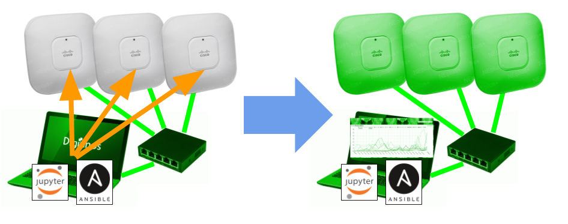
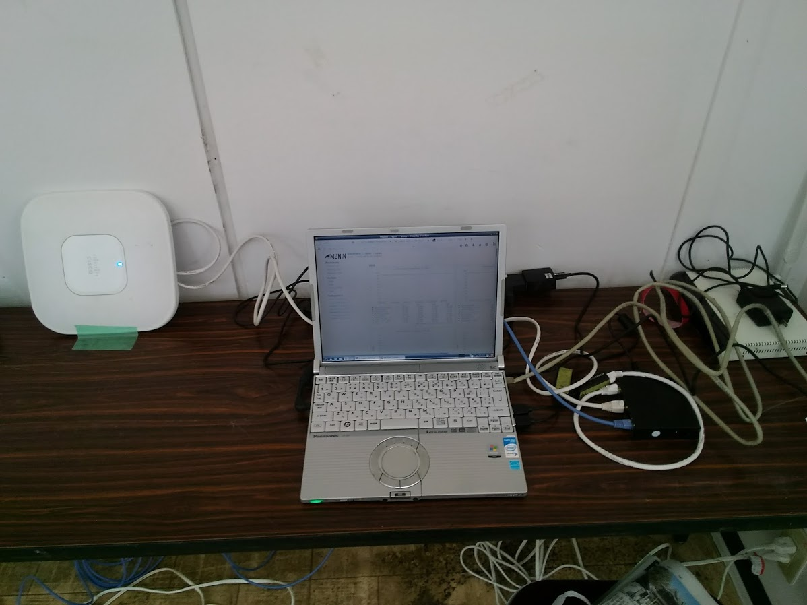

# wifi

vyosコンテナ+aironet1140をjupyterで組み上げる。イベント会場などで使えるwifi環境を構築する。



## 動作環境

* Debian9(dcoker-compose入り)
* 物理nicが3本で、下流に繋ぐ2本にブリッジを付けてあること

/etc/network/interfacesの例
```
# This file describes the network interfaces available on your system
# and how to activate them. For more information, see interfaces(5).

source /etc/network/interfaces.d/*

# The loopback network interface
auto lo
iface lo inet loopback

# The primary network interface
auto eth0
iface eth0 inet dhcp

auto enx14
iface enx14 inet manual

auto enx19
iface enx19 inet manual

auto br14
iface br14 inet static
address 192.168.14.1
netmask 255.255.255.0
bridge_ports enx14
bridge_maxwait 0
bridge_fd 0
bridge_stp off

auto br19
iface br19 inet static
address 192.168.19.1
netmask 255.255.255.0
bridge_ports enx19
bridge_maxwait 0
bridge_fd 0
bridge_stp off
```

## 事例



core2duoでギリdockerが動くので、捨てないで置いていたcf-w5が戦列に復帰。jupyter、vyos、muninのコンテナをホスト。

上流回線は、レンタル調達したモバイルルータを、クレードル経由で有線利用。会場が鉄筋建築1階の奥まった場所で電波状態が悪かったので、10Mbpsしか出なかったけど。

クライアントは9台、5台でUnity Collaborate、サーバとのセッションが切れること多かったけど、Collaborateの作りの問題もありそうな感じ。
